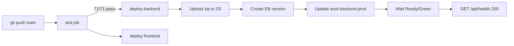

# CI/CD Pipeline

Automated testing and deployment for the Anot Health monorepo via GitHub Actions.

| Workflow | File | Trigger | Purpose |
|----------|------|---------|---------|
| **Test** | `.github/workflows/test.yml` | Push + PR to `main` | Backend + frontend unit tests, lint, production build |
| **Deploy** | `.github/workflows/deploy.yml` | Push to `main` | Test gate → EB backend deploy → health verification |
| **Security scan** | `.github/workflows/security-scan.yml` | Scheduled / manual | Dependency audit |


---

## Deploy pipeline flow



1. **Test** — `npm ci` + `npm test` in `anot-backend-main/anot-backend-main` (71 tests).
2. **Deploy-backend** — runs only when test passes and branch is `main`.
3. **Deploy-frontend** — validates production build; static hosting upload is manual/Vercel (non-blocking).

---

## AWS authentication (OIDC)

The deploy job uses **OpenID Connect** — no long-lived AWS access keys in GitHub.

| Requirement | Value |
|-------------|-------|
| IAM role | `arn:aws:iam::625242092266:role/GitHubActionsRole` |
| OIDC provider | `token.actions.githubusercontent.com` (configured in AWS IAM) |
| Trust policy | Allows `repo:1993ALINE/anot-health:ref:refs/heads/main` |
| Permissions | `elasticbeanstalk:*`, `s3:PutObject` on EB bucket, `iam:PassRole` if needed |

GitHub job permissions (deploy-backend):

```yaml
permissions:
  id-token: write   # required for OIDC token
  contents: read
  actions: read
```

At runtime, `aws-actions/configure-aws-credentials@v4` exchanges the GitHub OIDC token for temporary STS credentials scoped to the deploy role.

---

## Environment configuration

Defaults are baked into `.github/workflows/deploy.yml`. Override via **GitHub repository variables** or **secrets** if your environment differs.

| Variable / secret | Default | Purpose |
|-------------------|---------|---------|
| `AWS_DEPLOY_ROLE_ARN` (secret) | `arn:aws:iam::625242092266:role/GitHubActionsRole` | OIDC role to assume |
| `AWS_REGION` (var) | `ap-southeast-1` | AWS region |
| `AWS_EB_APPLICATION` (var/secret) | `anot-backend` | EB application name |
| `AWS_EB_ENVIRONMENT` (var/secret) | `anot-backend-prod` | EB environment name |
| `S3_BUCKET` (var/secret) | `elasticbeanstalk-ap-southeast-1-625242092266` | Deployment artifact bucket |
| `API_HEALTH_URL` (var) | `https://app.anot.health/api/health` | Post-deploy smoke test |

Configure at: **Settings → Secrets and variables → Actions**

Recommended secrets (optional if defaults are correct):

- `AWS_DEPLOY_ROLE_ARN`
- `AWS_EB_APPLICATION`
- `AWS_EB_ENVIRONMENT`
- `AWS_REGION`

---

## Deployment artifact

The workflow builds a zip with `tar` (forward-slash paths for Linux/EB), matching `scripts/deploy-to-eb.ps1`:

- Includes: source, `migrations/`, `.ebextensions/`, `package.json`
- Excludes: `node_modules`, `.env`, `coverage`, uploads

Version label format: `ci-{run_number}-{short_sha}` (e.g. `ci-42-a1b2c3d`).

---

## Success criteria

After `git push origin main`:

| Step | Expected |
|------|----------|
| test | ✅ 71/71 tests pass |
| deploy-backend | ✅ Zip uploaded to S3 |
| EB update | ✅ Environment **Ready / Green** |
| Health check | ✅ `GET /api/health` → 200, `"status":"ok"` |

---

## Manual deploy fallback

If the GitHub Actions deploy job fails, production can still be updated manually:

```powershell
cd anot-backend-main\anot-backend-main
powershell -File scripts\deploy-to-eb.ps1
```

Pre/post checks:

```bash
./scripts/pre-deploy-checklist.sh
./scripts/post-deploy-verification.sh
```

See [DEPLOYMENT_RUNBOOK.md](./DEPLOYMENT_RUNBOOK.md) for rollback and escalation.

---

## Troubleshooting

| Symptom | Likely cause | Fix |
|---------|--------------|-----|
| `Could not assume role` | OIDC trust policy or role ARN wrong | Verify IAM role trust for `1993ALINE/anot-health` and `AWS_DEPLOY_ROLE_ARN` secret |
| `Access Denied` on S3 | Role missing `s3:PutObject` | Add EB bucket permissions to `GitHubActionsRole` |
| Health wait timeout | Checks wrong EB field (`Ok` vs `Green`) | Fixed in deploy.yml — uses `Health=Green` or `HealthStatus=Ok` |
| Smoke test fails | Response is `"status":"ok"` not `healthy` | Fixed — grep accepts both |
| Test passes, deploy skipped | Not on `main` | Deploy only runs for `refs/heads/main` |

---

## Related docs

- [DEPLOYMENT_RUNBOOK.md](./DEPLOYMENT_RUNBOOK.md) — team SOP, rollback
- [SSM_PARAMETERS.md](./SSM_PARAMETERS.md) — production secrets
- [SECURITY.md](../SECURITY.md) — deployment security controls
