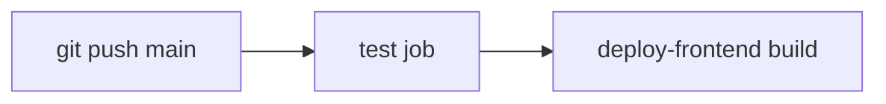

# CI/CD Pipeline

**Tests auto-run on every push; production deploy is manual.**

| Workflow | File | Trigger | Purpose |
|----------|------|---------|---------|
| **Test** | `.github/workflows/test.yml` | Push + PR to `main` | Backend + frontend unit tests, lint, production build |
| **Deploy** | `.github/workflows/deploy.yml` | Push to `main` | Backend tests + frontend build validation (no automated EB deploy) |
| **Security scan** | `.github/workflows/security-scan.yml` | Scheduled / manual | Dependency audit |


---

## What runs automatically



1. **Test** — `npm ci` + `npm test` in `anot-backend-main/anot-backend-main` (71 tests).
2. **Deploy-frontend** — validates the production Vite build (upload to hosting is manual).

The **deploy-backend** job is disabled in GitHub Actions. Backend production releases use the manual script below.

---

## Manual backend deploy

After tests pass locally or in CI:

```powershell
cd anot-backend-main\anot-backend-main
powershell -File scripts\deploy-to-eb.ps1
```

Optional pre/post checks:

```bash
./scripts/pre-deploy-checklist.sh
./scripts/post-deploy-verification.sh
```

Full SOP: [DEPLOYMENT_RUNBOOK.md](./DEPLOYMENT_RUNBOOK.md)

---

## Why deploy is manual

- Avoids AWS OIDC / IAM configuration failures in CI
- Matches the proven `deploy-to-eb.ps1` flow (tar bundle, EB wait, health check)
- Operators run deploy consciously after reviewing test results and migrations

---

## Node.js version

All GitHub Actions jobs use **Node.js 22** (matches local development and Elastic Beanstalk).

---

## Related docs

- [DEPLOYMENT_RUNBOOK.md](./DEPLOYMENT_RUNBOOK.md) — team SOP, rollback, escalation
- [SSM_PARAMETERS.md](./SSM_PARAMETERS.md) — production secrets
- [SECURITY.md](../SECURITY.md) — deployment security controls
